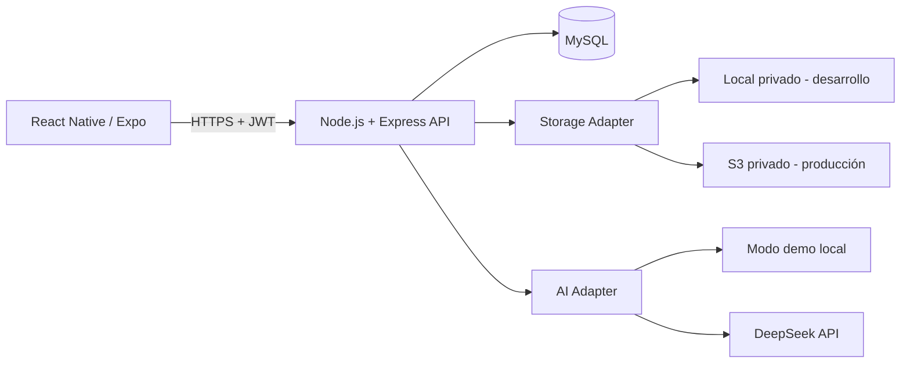
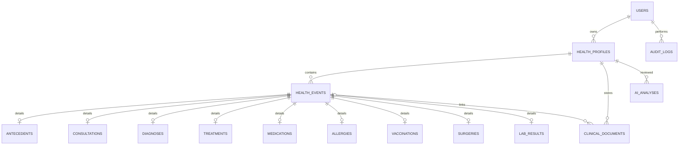

# Arquitectura de Clinicsoft

## Diagrama lógico

## Capas

### Móvil

- Autenticación y sesión con `expo-secure-store`.
- Selector de perfil activo.
- Formularios progresivos para eventos.
- Línea de tiempo y filtros.
- Documentos.
- Resumen preconsulta sin IA.
- Selección explícita de registros para IA.

### Backend

- `routes`: contratos HTTP.
- `middleware`: autenticación, errores y autorización por perfil.
- `services`: eventos, almacenamiento, IA, auditoría y tokens.
- `config`: variables de entorno y conexión MySQL.

### Base de datos

El historial no se concentra en una sola tabla. `health_events` contiene el núcleo cronológico y las tablas especializadas contienen los atributos propios de cada tipo.

## Autorización

Todo endpoint que opere sobre un perfil ejecuta una verificación por `profile_id + owner_user_id`. Conocer un UUID no permite acceder a un recurso perteneciente a otra cuenta.

## IA

1. El usuario selecciona de 1 a 50 eventos.
2. Backend verifica que todos pertenecen al perfil autorizado.
3. Se recuperan únicamente esos registros y sus detalles.
4. El adaptador construye un payload sin nombre, correo ni identificadores directos del perfil.
5. DeepSeek recibe instrucciones estrictas de salida no diagnóstica.
6. Se valida formato JSON.
7. Un filtro de seguridad bloquea patrones incompatibles con el alcance.
8. Se registra la trazabilidad del análisis.

## Documentos

Los documentos nunca se sirven desde una carpeta pública. El backend verifica sesión, perfil y documento antes de abrir el stream del archivo local o del objeto S3.

## Frontend universal Android / iOS / Web

El frontend no se divide en una aplicación móvil y una web independiente. `frontend/` contiene una única aplicación React Native + Expo. React Native Web transforma los mismos componentes de interfaz para navegador, mientras Android e iOS usan sus renderizadores nativos. Las diferencias inevitables de plataforma (almacenamiento seguro, descarga de archivos y selección de documentos) se encapsulan mediante `Platform.OS` y adaptadores pequeños, manteniendo compartidas las pantallas, navegación, lógica de negocio, tipos y cliente de API.
